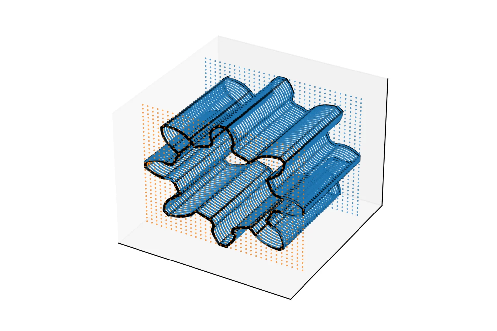
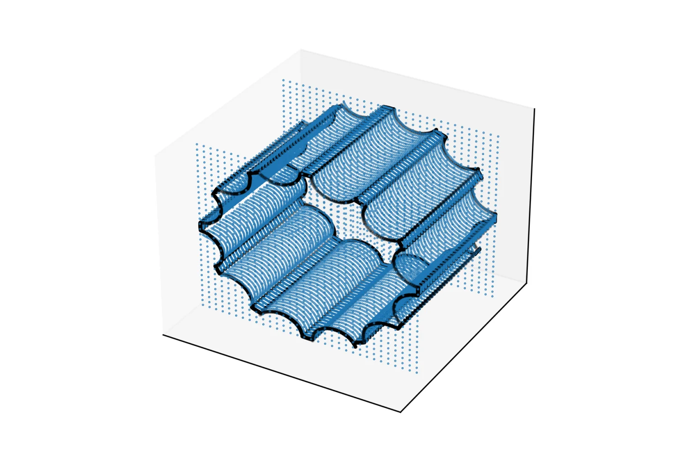
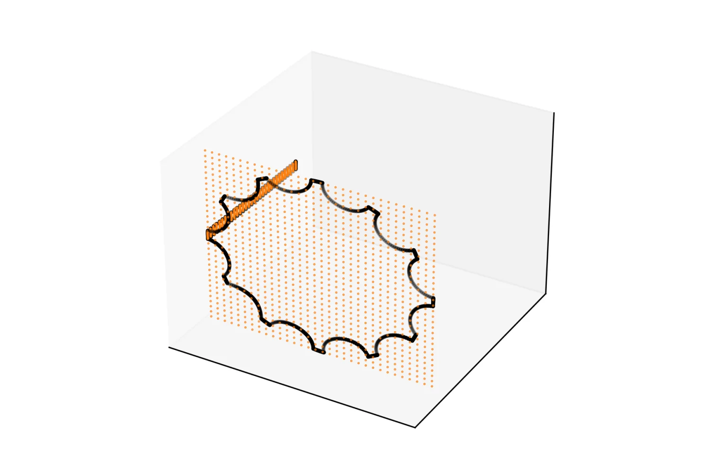

如果生成模型不仅能“画出”一个三维物体，还能接收装配接口、孔边界或功能表面作为条件，自动补全为可编辑、可网格化的 CAD 实体，它就有机会真正进入 CAE 工作流。

[AutoBrep](https://github.com/AutodeskAILab/AutoBrep) 是 Autodesk AI Lab 开源的 B-Rep 自回归生成模型。与生成点云、体素或渲染图像的方法不同，它直接表示 CAD 中的面、边及其拓扑关系，并可将结果重建为 STEP。这个项目不是对 AutoBrep 原始工作的重新署名，而是一次围绕其公开代码和权重开展的**复现与条件生成扩展探索**：复现无条件生成，验证前缀补全，搭建用户几何输入管线，并确定公开 checkpoint 的实际能力边界。



## 为什么它与 AI for CAE 有关

CAE 的上游通常不是一张图，而是带有精确边界、拓扑关系和工程语义的几何模型。一个看起来合理但不闭合的表面，往往无法直接划分网格；一个没有保留接口位置的零件，也无法进入装配、接触或边界条件设置。

因此，面向 CAE 的几何生成需要同时回答三个问题：生成结果是否满足给定设计约束，拓扑是否足够完整，以及结果能否回到 CAD/CAE 软件继续处理。AutoBrep 的 B-Rep 表示为这条链路提供了一个有吸引力的起点，而条件生成则让模型从“随机造型”走向“在工程约束下提出候选方案”。

一个理想的闭环可以写成：

```text
接口面、孔边界或已有局部几何
        ↓
条件 B-Rep 生成
        ↓
拓扑与几何有效性检查
        ↓
网格划分与高保真仿真
        ↓
物理指标筛选与设计迭代
```

生成模型负责扩展设计空间，传统几何内核保证模型可用，CAE 求解器则判断候选是否在物理上成立。它们不是互相替代，而是组成从约束、生成到验证的工具链。

## 第一步：复现公开模型的 B-Rep 生成

公开推理流程能够从复杂度条件出发，自回归生成面、边及其拓扑 token，再通过曲面和曲线解码器重建几何。复现实验成功生成了可解码的 B-Rep，并导出为 STEP，为后续补全实验提供了基线。



这里真正重要的不是模型是否能产生一幅三维可视化，而是生成序列能够闭合，并经过几何重建形成下游工具可以继续读取的 STEP 文件。这是它区别于一般三维图像生成方法、也更接近 AI for CAE 的关键。

## 可用的条件工具：原生 token 前缀补全

为了先验证“给定一部分几何，让模型继续完成其余结构”这条路径，我实现了一个可靠的前缀补全基线：先生成一个完整 B-Rep，保留前若干个完整面记录作为条件前缀，再让自回归模型从这个位置继续生成。

该路径已经通过四项检查：条件位置的最大绝对误差为 0，条件几何编码完全一致，生成结果能够解码，并且能够导出 STEP。页面开头的结果图中，橙色点表示保留的条件前缀，蓝色点表示模型补全的几何。

这种模式已经构成一个可运行的条件几何生成工具，但它的条件来自模型自身的原生 CAD token。它适合研究拓扑续写和候选多样性，还不能等同于“任意用户 STEP 面输入”。

## 从用户 STEP 面构造几何条件

为了让条件来自工程师已有的 CAD 几何，我进一步搭建了用户面输入管线：读取 STEP 和选定面，使用几何内核采样面与边的点网格，完成全局归一化、局部包围盒表达和参数方向排序，再通过 FSQ 编码器生成 `BOGEOM ... EOGEOM` 几何提示。

```text
STEP + 用户选择的面
        ↓
面/边点网格与拓扑提取
        ↓
归一化、排序与 FSQ 编码
        ↓
BOGEOM 条件 token
        ↓
自回归 B-Rep 补全
```



在当前样例中，管线成功处理 2 个用户面和 27 条边，构造出长度为 286 的几何提示。这说明从实际 STEP 几何到模型条件 token 的输入侧工程链路已经贯通。

## 公开 checkpoint 的能力边界

输入管线成功并不意味着公开权重已经具备用户面条件补全能力。代码检查发现，公开训练配置使用 `load_geom: false` 和 `geom_ratio: 0.0`，训练序列中的 `geom_tokens` 也被注释掉。这表明公开 checkpoint 主要学习的是无条件 CAD 序列，而不是带 `BOGEOM` 上下文的生成。

为了排除 STEP 采样和新输入代码造成的影响，我又进行了更严格的 token-native 验证：直接从模型自己生成的有效 B-Rep 中提取原生面、边和 FSQ token，重新构造几何提示，再送回同一个自回归模型。即使条件完全来自模型自身，生成仍然运行到长度上限，没有产生结束层级和闭合实体所需的 `EOL`、`EOC` 与 `EOS`，因而无法解码。

因此，目前可以得出一个清楚但克制的结论：

| 能力 | 当前状态 |
| --- | --- |
| 无条件 B-Rep 生成并导出 STEP | 已复现 |
| 基于原生 CAD token 的前缀补全 | 已验证可用 |
| 从用户 STEP 面构造 `BOGEOM` 条件 | 输入管线已贯通 |
| 使用公开 checkpoint 完成用户面条件生成 | 尚不可用 |

这不是条件生成思路本身的失败，而是公开权重与目标推理格式不匹配。下一步需要在训练序列中恢复几何 token，设置非零的几何条件采样比例，并对自回归模型进行微调或重新训练。只有 token-native 验证能够稳定产生闭合序列后，才值得继续优化用户面选择、边排序和交互体验。

## 这次复现提供了什么

这项工作的价值不只是“跑通一个开源模型”。它给出了一个面向 AI for CAE 的条件几何生成工具原型，也通过逐层验证明确区分了三件容易混淆的事：几何输入是否能被编码、模型是否理解这种条件，以及输出是否能成为有效 CAD 实体。

从工程角度看，真正可用的生成式设计系统不能只展示最漂亮的样例，还需要知道失败发生在输入表示、生成权重还是几何重建阶段。当前原型已经覆盖条件几何抽取、编码、前缀补全、强验证和 STEP 输出；下一阶段的核心不再是继续包装推理接口，而是获得真正接受几何条件训练的 checkpoint，并把生成结果接入网格质量和物理仿真评价。

原始模型与论文：[AutoBrep 开源仓库](https://github.com/AutodeskAILab/AutoBrep) · [AutoBrep 论文](https://arxiv.org/abs/2512.03018)
