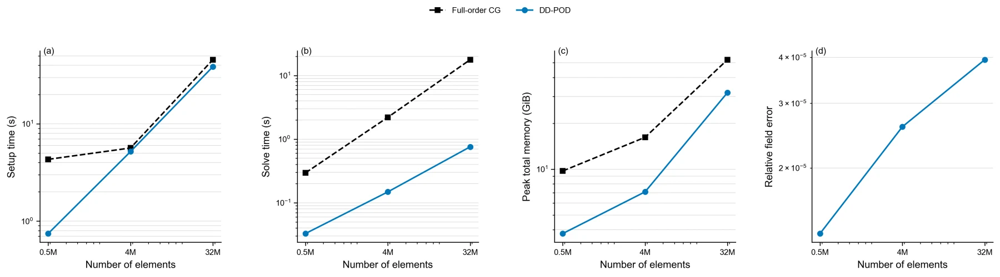
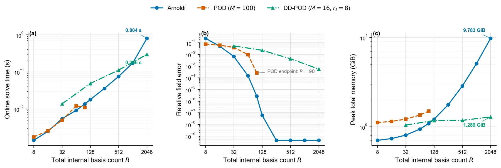
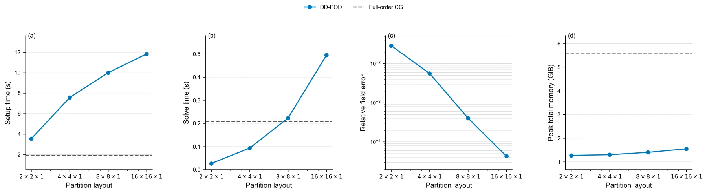
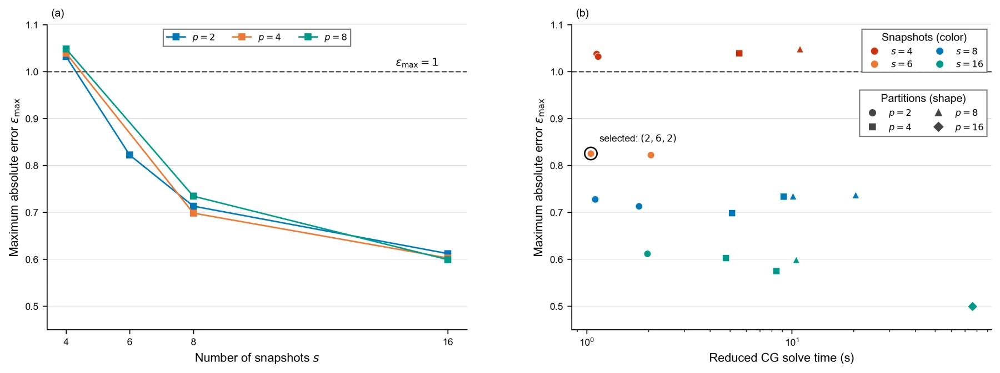

芯片结构、材料和边界条件固定后，不同工作负载主要改变成千上万个热源的功率组合。每一个新工况都要再次求解规模巨大的热传导方程：单次高保真结果可以作为可靠参考，但面对参数扫描、瞬态轨迹和设计优化时，重复计算的时间与内存成本很快成为瓶颈。

这项工作研究一种**完整界面区域分解本征正交分解方法（DD-POD）**：把全局计算域拆成多个非重叠子域，在每个子域内部建立独立的低维 POD 基，同时完整保留子域之间的界面自由度。研究不仅提出算法，也把它与全阶预条件共轭梯度法、全局 POD 和 Arnoldi 型 Krylov 降阶放在统一框架中比较，回答“什么情况下该用哪种方法”。

## 问题：系统不变，热源工况反复变化

稳态与隐式时间离散后的瞬态热传导问题，都可以写成同一类对称正定线性系统。芯片几何、材料与散热条件决定系统矩阵，热源功率则进入右端项。于是，多工况仿真的核心不再是一次求解，而是如何复用固定系统的信息，减少后续每个新功率组合的计算成本。

本研究比较四条技术路线：

| 方法 | 利用的信息 | 主要优势 | 主要成本 |
| --- | --- | --- | --- |
| 全阶 PCG | 稀疏系统与预条件器 | 误差控制直接，不需要训练 | 每个工况都需全规模迭代 |
| 全局 POD | 全场训练快照 | 在线系统小、全局低秩时效率高 | 快照生成与全局基存储 |
| Arnoldi | 系统算子与起始载荷 | 不依赖预先准备的 POD 快照集 | 全局正交化和基存储随阶数增长 |
| 完整界面 DD-POD | 局部快照与区域耦合 | 独立表达不同区域的局部响应 | 完整界面系统可能成为瓶颈 |

## 方法：局部压缩，界面不压缩

DD-POD 先根据网格或稀疏矩阵的耦合图划分子域。每个子域的自由度分成“内部”和“界面”两部分：内部温度场由局部 POD 基近似，所有共享节点则保留为唯一的全局界面温度。

在线求解时，算法先消去各子域的小型降阶坐标，再把局部贡献装配成一个全局 Schur 界面方程。相邻子域读取同一个界面温度，因此温度连续性由变量表示直接保证；装配后的界面贡献保持热流平衡。由于原系统和降阶变换都保持相应结构，最终界面系统仍为对称正定，可继续使用预条件共轭梯度法求解。

这一设计的核心取舍很明确：局部内部基降低大规模全局基的存储与运算压力，完整界面则避免拼接误差并保留稳定的物理耦合；但分区过细时，界面自由度和迭代成本也会快速增加。

## 比较框架：名义阶数相同，不代表资源相同

全局 POD 的阶数 `r` 表示 `r` 个全局方向，而含 `Ns` 个子域的 DD-POD 若每个子域都取 `r` 阶，内部表示实际包含 `Ns × r` 个局部方向，此外还完整保留界面变量。因此，仅比较相同的名义阶数会夸大局部方法的优势。

研究分别采用等训练信息、等内部基总数、等精度目标和等资源预算四种口径，并将快照生成、模型构造、在线求解、全场重构与峰值内存分开统计。下图显示，在相同内部基总数下，Arnoldi 在模型算例上具有更低误差；DD-POD 的优势则主要体现在高基数区间的在线时间和内存扩展性。

## 模型实验：规模越大，DD-POD 的在线收益越明显

在包含 100 个独立热源的 500k、4m 和 32m 网格上，DD-POD 固定采用 `4 × 4 × 1` 分区，并取 16 个训练快照和每个子域 16 阶局部基。相较全阶 CG–GAMG：

| 网格规模 | DD-POD 代数自由度 | 求解加速比 | 峰值内存降低 | 相对场误差 |
| --- | ---: | ---: | ---: | ---: |
| 500k | 13,600 | 8.98 倍 | 61.2% | 1.326 × 10⁻⁵ |
| 4m | 51,068 | 14.87 倍 | 56.1% | 2.590 × 10⁻⁵ |
| 32m | 198,013 | 23.40 倍 | 39.2% | 3.943 × 10⁻⁵ |

三组结果的误差都低于 `4 × 10⁻⁵`，求解加速比则随全阶规模增大而持续提高。不过，内存节省比例有所下降，说明完整界面和并行数据结构正逐渐成为主要成本。

分区敏感性实验也揭示了精度与代价的边界：在 500k 网格、16 个快照和 16 阶局部基下，将分区从 `2 × 2 × 1` 细化到 `16 × 16 × 1`，相对误差降低约 669 倍；与此同时，初始化和界面求解时间持续增加。较粗分区更有利于速度与内存，较细分区则主要用于换取精度。

## 亿级真实任务：局部方法并非总是最优

真实样品矩阵来自芯片热计算物理数据的离散结果，包含约 **1.73 亿个温度自由度、12.2 亿个导热矩阵非零元和 11,023 个独立功率输入**。基准全阶工况使用 48 个 MPI 进程，线性系统求解约需 1,257 秒；16 个训练快照的建立与求解累计约 4.34 小时，快照生成因此成为主要离线成本。

在 DD-POD 的 17 组参数扫描中，`2` 个子域、`6` 个快照、局部 `2` 阶的配置以较低资源达到最大绝对误差小于 1 的目标：约化代数系统含 243,633 个自由度，比全阶系统减少 99.86%；相对场误差为 `2.301 × 10⁻³`，最大绝对误差为 `0.825`，降阶 CG 求解时间为 `1.048` 秒。

更重要的是，这组真实功率扰动呈现较强的**全局低秩性**。使用相同 6 个快照和 2 阶基时，全局 POD 的误差与 DD-POD 接近，但模型启动仅需 6.45 秒、在线求解仅需 0.0038 秒，明显低于完整界面 DD-POD。只有提高局部空间容量后，DD-POD 才能进一步降低误差，同时付出更高的模型构造与界面求解成本。

这说明 DD-POD 不是对全局 POD 的无条件替代：当响应集中在低维全局子空间时，应优先使用全局 POD；当热源多、响应局部差异明显、全局秩持续增长且界面规模可控时，DD-POD 的局部表示才更有价值。

## 方法选择与下一步

- **查询次数少或系统矩阵经常变化**：优先直接使用全阶 PCG，避免无法摊销的离线成本。
- **训练奇异值快速衰减**：优先全局 POD，以更小的在线系统获得目标精度。
- **缺少快照集且目标载荷明确**：可测试 Arnoldi，但需同时检查全阶残差、场误差和基存储。
- **局部响应差异明显且全局阶数增长较快**：采用 DD-POD，并重点控制界面规模。

后续优化将集中在界面粗空间或界面压缩、自适应子域阶数、快照压缩与增量更新，以及更充分的独立验证轨迹。目标不是寻找对所有工况都占优的单一算法，而是把解空间结构、精度目标、模型复用次数和计算资源连接成可验证的选择流程。
