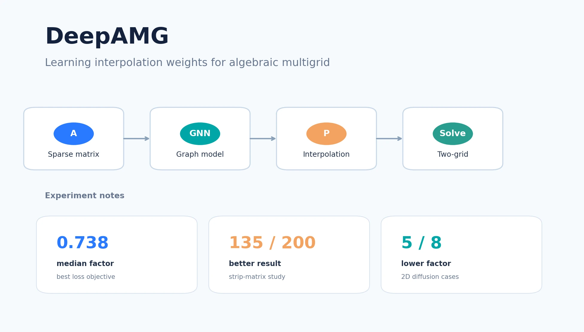
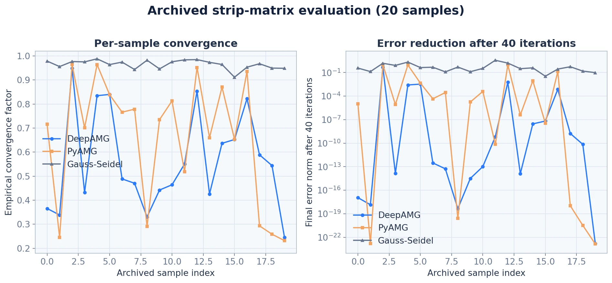
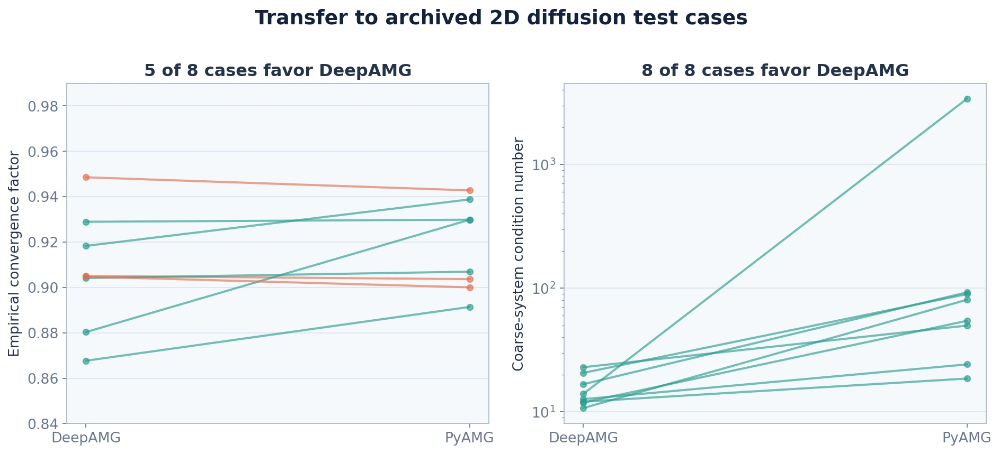

这项工作最初不是从“用 GNN 优化 AMG”这个完整命题出发的，而是来自我对 Problem Independent Machine Learning（PIML）和区域分解方法的思考。PIML 的核心是学习“边界到内部”的插值关系，把完整有限元系统凝聚为边界上的问题。当时张老师提出一个问题：**区域分解通常不考虑粗网格，能否引入粗网格加速收敛？**

我当时的回答是：如果 PIML 在构造边界到内部的插值，那么引入粗网格后，问题就可以改写为构造**粗网格到细网格的插值矩阵**。这正是 AMG 的核心对象 `P`。

## 我想解决的其实是插值问题

给定稀疏线性系统

$$Ax=b,$$

AMG 在 setup 阶段先把自由度分为粗点 `C` 和细点 `F`。对误差方程，理想情况下有

$$e_F=-A_{FF}^{-1}A_{FC}e_C.$$

但是直接计算 $A_{FF}^{-1}A_{FC}$ 不现实，所以需要构造稀疏的近似插值矩阵 `P`，使 $e_F\approx Pe_C$，再得到粗网格算子

$$A_c=P^TAP.$$

我并不想重新设计整个 AMG。V-cycle、W-cycle、光滑器和粗网格校正都可以保留，只在插值矩阵的构造阶段引入神经网络。我希望用可控的 setup 开销换取更好的收敛性，同时保留经典 AMG 的成熟框架。

对 `P` 的约束也不能交给网络自由学习：粗点上必须是恒等映射，对一些问题还要保持常量模式 $P\mathbf 1_c=\mathbf 1_f$，并能表示矩阵的近零空间。因此，当前实现保留 PyAMG 的 Ruge–Stüben 粗细点划分和候选连接，让 GNN 只学习插值权重。

## 为什么把它做成图上的边回归

我把稀疏矩阵 `A` 直接转换为有向图：

- 每个自由度是一个节点，节点特征表示它是粗点还是细点；
- $A_{ij}\ne0$ 就对应一条边，矩阵元素值是边特征；
- GNN 不改变连接关系，只输出新的边标量 $\hat e_{ij}$；
- 对每个细点，仅取它到相邻粗点的输出，归一化后填入 `P`；粗点到自身的权重固定为 1。

这样把一个输出维数随矩阵大小变化的矩阵预测问题，改成了稀疏图上的边回归问题。网络参数量不再与 `P` 的非零元个数直接挂钩，这也是我认为它有机会做到跨矩阵复用的原因。

### 关于“分块”的一次修正

我一开始认为，全局插值矩阵难以预测，可以沿用区域分解的思路，把 `A` 分成局部块，分别预测 $P_i$ 后再组装。这样看上去能降低单次计算与存储开销，也方便并行。

但在后续记录中，我对这个判断做了修正：**GNN 处理子图与处理完整稀疏图，开销不一定有本质改善；人为分块还可能破坏图的连通性和跨块强耦合。** 因此，当前代码的主线是直接对整个稀疏图预测边权；分块只能在有明确计算收益、且能正确处理界面自由度时再引入。

## 损失函数：理论上直接，不等于训练上稳定

两网格迭代的收敛速度由误差传播算子 `E` 的谱半径 $\rho(E)$ 决定。所以我最初认为，最直接的做法就是最小化谱半径。为避免大矩阵特征值分解，我用随机单位向量和幂迭代估计

$$\rho(E)\lesssim\left(\max_i\|E^Kx_i\|\right)^{1/K}.$$

这个方法计算快，但真正用它训练时并不轻松。`E` 中包含 $A_c^{-1}$，反向传播还要穿过多次矩阵乘法，实验中出现了数值放大、梯度消失和梯度爆炸。幂迭代次数不能太大，需要取 $K$ 次方根，而且 `float64` 明显比 `float32` 更容易训练。

另一条路线是能量最小化。对 SPD 矩阵，我希望 `P` 的列向量尽量表示低能量、光滑的误差模式，因此使用

$$\operatorname{Tr}(P^TAP)=\sum_jp_j^TAp_j$$

作为代理损失。它不需要求逆，也不依赖具体光滑器，实验中训练更快、成功率更高。但这个损失必须和粗点恒等、行和为 1 以及近零空间保持等约束一起使用，否则会退化。

 的收敛结果最好，Tr(Ac) 的粗网格条件数更稳定")

我在 `nos4` 矩阵上对四种目标各独立训练 20 次。Frobenius 范数的收敛因子中位数为 `0.946`；谱半径、`Tr(E)` 和 `Tr(Ac)` 分别为 `0.819`、`0.738` 和 `0.825`。这个结果对我的启发是：**损失函数必须和最终收敛目标对齐，但也必须考虑它是否真的可训练。** “精确计算谱半径”并不等于“能得到更好的训练结果”。

## 条带矩阵：我更关心“什么情况下有用”

第一组数据来自带局部加密条带的 Laplace 问题。网格规模 `N` 在 10–40 之间随机取值，条带宽度与位置也随机生成。我一共构造了 **200 个线性算子**，矩阵阶数为 88–1,443；粗细点划分由 PyAMG 给出，单层 GNN 只更新边，用能量损失学习新的插值权重。

在 200 个算例中，**135 个算例的 GNN 结果优于经典方法**。但我认为更重要的不是这个总数，而是优势出现在哪里：

- 当经典 AMG 在某些条带参数下表现较差时，GNN 的改善更明显；
- 条带较粗时，GNN 可以预测出明显更好的插值；
- 条带继续变细后，GNN 和经典 AMG 都会变差。

这说明学习方法更可能是经典插值规则的**补充**，而不是在所有参数区间都占优的替代品。

当前代码目录中仅保留了一份 20 个样本的 CSV 结果子集。在这个子集上，DeepAMG、PyAMG 和单独 Gauss–Seidel 的收敛因子中位数分别为 `0.516`、`0.726` 和 `0.970`；DeepAMG 在 13/20 个样本上优于 PyAMG。下图展示的是这份归档子集，不是上述 200 个算例的完整结果。

## 二维扩散问题：跨矩阵复用只是起点

第二组实验是齐次 Dirichlet 边界下的二维扩散方程：

$$-\nabla\cdot(\kappa\nabla u)=f.$$

我用分块随机的各向异性系数生成矩阵，网格划分 `Nx = Ny` 在 8–64 之间取值，属性块 `Bx = By` 在 1–32 之间取值。当前归档 CSV 中有 8 个有效未见测试样本：DeepAMG 在 5/8 个样本上得到更低的经验收敛因子，在 8/8 个样本上得到更低的粗网格条件数。

这组结果说明网络学到的局部插值规则有跨矩阵复用的可能，但它还没有解答我真正关心的问题：

1. 为什么 GNN 消息传递层加深后，效果反而变差？
2. $A_c$ 的特征值跨越多个数量级时，直接优化 trace 是否会被大特征值支配？
3. 如果单层 GNN 就足够，这是否意味着问题可以进一步简化为显式的局部插值规则？
4. 实验图中 `Bx = 0.5 Nx` 附近的行为是数据构造造成的，还是对应某种真实的数值分界？

## 我现在对这个项目的理解

第一，DeepAMG 当前做的事情很有限：它改变了 `P` 的构造方式，但没有降低 $P^TAP$ 的稀疏矩阵乘法复杂度，也没有学习粗细点划分。它的价值应该体现在用较高的 setup 开销换取更少的迭代次数，这需要报告完整的端到端求解时间，而不只是收敛因子。

第二，“Problem Independent”仍然是一个待验证的目标，不是当前结果。PDE 信息确实蕴含在矩阵中，但网络能否在不同尺度、异质系数、网格拓扑和粗化策略之间复用，仍取决于训练集、尺度归一化和硬约束设计。

第三，下一阶段不应继续只堆叠网络，而应该回到数值问题本身：与能量最小化 AMG 对比，分析纯各向异性问题，检查条带结构下的粗细点划分，并在固定随机种子和严格独立的训练/验证/测试集上，同时比较收敛、稳定性、稀疏度和运行时间。

我也曾考虑过完全不显式构造 `P`，而是用非线性网络直接作为插值算子 $\mathcal P$ 和限制算子 $\mathcal R$。但这条路线需要处理粗点恒等、$\mathcal R$ 与 $\mathcal P$ 的伴随关系、SPD 结构以及大矩阵乘法开销，目前还没有足够的理论保障。相比之下，先把“学好一个受约束的稀疏线性插值矩阵”做扎实，是当前更合理的一步。
