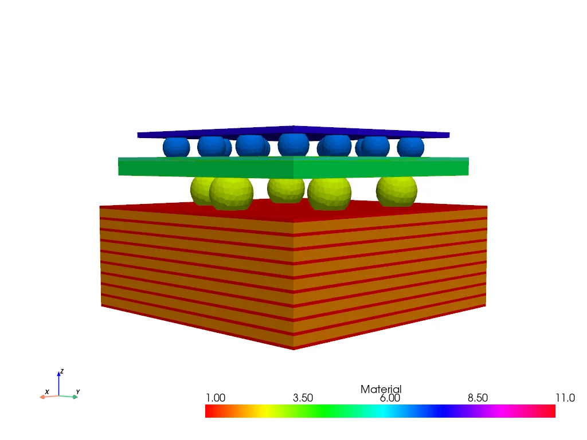
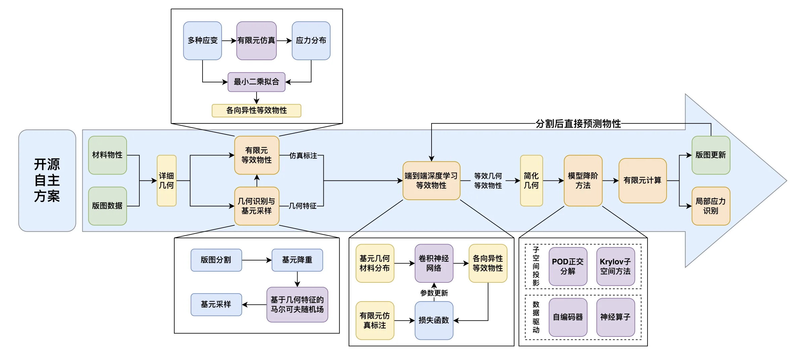
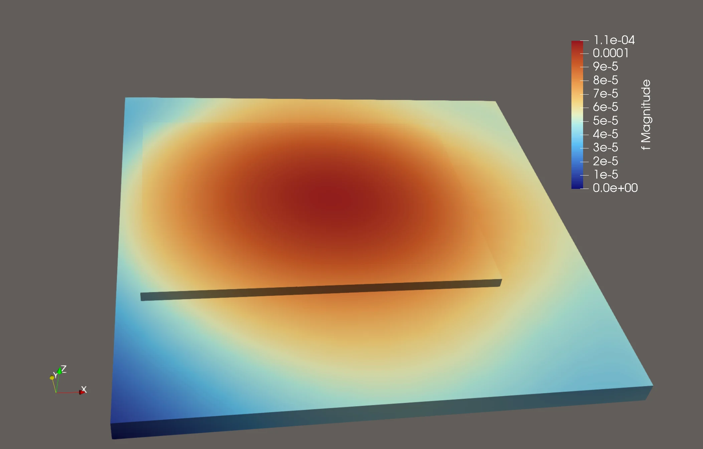
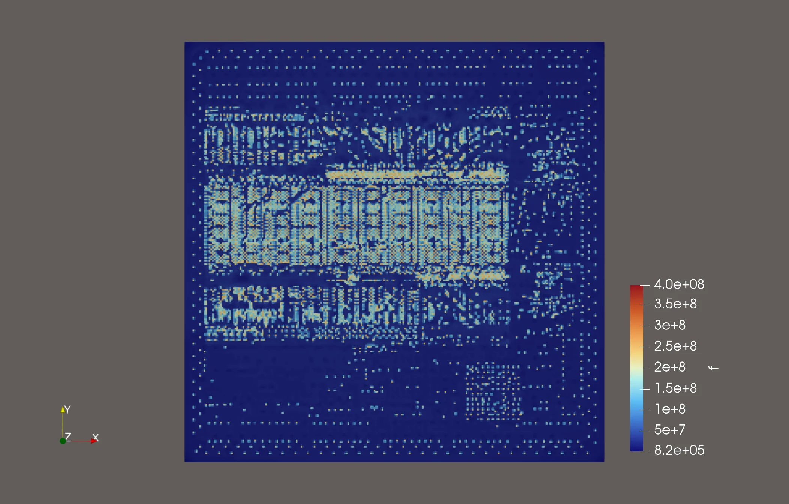
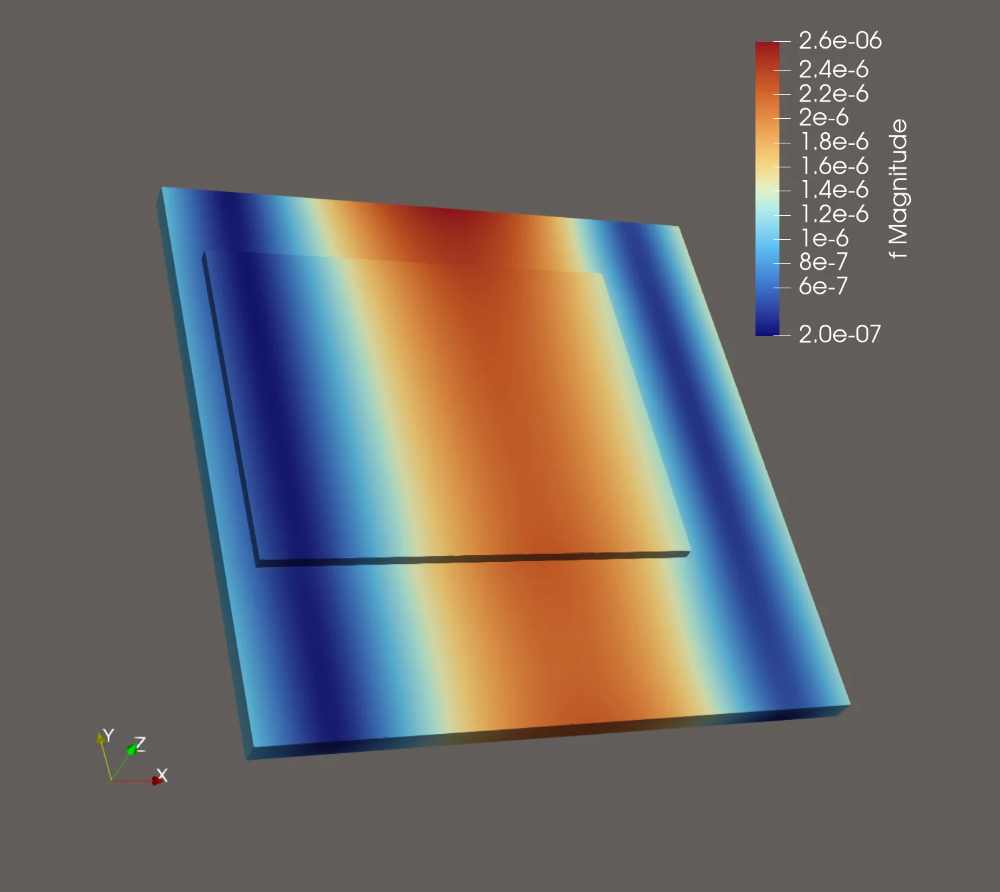
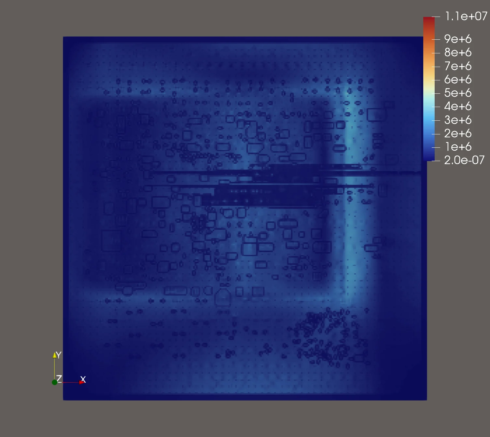

## 项目概述

三维异构集成把芯片、转接板、载板、硅通孔、微焊球和多层布线集成在同一封装体内。局部互连结构可能只有微米尺度，而完整封装达到毫米甚至厘米尺度；如果在一个有限元模型中显式保留全部细节，网格规模会迅速增长，难以在工程设计周期内反复完成力-热分析。

本项目围绕“三维异构集成力-热仿真降阶建模”问题，开发了一套物理建模与数据驱动相结合的多尺度仿真框架。方法从 Gerber 版图中提取局部几何，把重复出现的微观结构转化为具有各向异性等效物性的规则基元，再利用深度学习完成批量预测，最终将等效材料映射到宏观封装模型中进行热变形和三点弯曲仿真。

## 问题背景

赛题给出的典型再布线层特征尺寸约为 2 μm，封装整体尺寸可达 50 mm，尺度跨越四个数量级。若使用传统有限元方法直接离散所有布线、通孔和焊点，模型可能达到千万乃至上亿量级，计算时间和内存占用都会成为瓶颈。

因此，项目需要同时回答三个问题：如何从复杂版图中提取具有代表性的局部结构，如何在不显式保留细观几何的情况下表达其力学与热学响应，以及如何把局部等效结果稳定地传递到完整封装模型。我们的解决思路可以概括为“选得准、算得精、学得快”。

## 核心方法

### 1. 选得准：基元划分与代表性采样

程序首先将 Gerber 文件渲染为材料分布图，再按规则网格切分为 8×8 像素的局部基元。对于旋转或翻转后等价的结构，使用正方形的八种对称变换进行归并，避免为重复几何反复计算等效物性。

在降重后的候选基元上，项目使用 Ising 型马尔可夫随机场描述相邻材料之间的空间相关性，并根据能量分布进行分层采样。与只按照材料体积分数抽样相比，这一表示能够区分材料比例相近、但界面形态和连通结构不同的基元。

### 2. 算得精：有限元等效物性

对于选中的基元，程序建立保留细观材料分布的有限元模型，分别施加三个方向的正应变和三个方向的剪应变，计算体积平均应力与应变。随后根据线弹性本构关系，通过最小二乘方法拟合等效刚度矩阵，并计算热膨胀系数。

这种数值均匀化方法不只考虑材料含量，还能感知材料的几何分布和方向性。结合封装叠层关于平面的对称特征，单个基元最终用 13 个独立刚度分量和 3 个热膨胀系数描述，可作为各向异性均质材料参与宏观计算。

### 3. 学得快：端到端等效物性预测

高精度细观有限元能够提供可靠标签，但逐个计算全部基元成本较高。为此，项目训练卷积神经网络，以 8×8 基元图像为输入，直接预测 16 维等效物性向量。网络完成训练后，可以为相同材料体系下的大量局部结构批量生成物性，再汇总成宏观有限元使用的材料数据库。

## 工程流程

完整流程从版图和基础材料参数出发，经由几何识别、基元采样、有限元标注与深度学习预测生成简化材料模型；随后使用 Gmsh 建立宏观网格，通过 FEniCSx 组装各向异性热弹性问题，并由 PETSc 完成并行线性求解。

这条流程把计算成本集中在少量代表性基元的高精度标注上，其余局部结构通过学习模型获得等效物性。宏观模型不再显式刻画每条微米级走线，但仍可在材料参数中保留其方向性和空间差异。

## 竞赛阶段结果

决赛测试模型在平面方向采用约 127 μm 的基元步长，共划分 260×260 格，厚度方向划分 36 层。最终模型约包含 212 万个节点和 203 万个单元，使用双路 Intel Xeon Silver 4214R 服务器、125 GB 内存，并采用 PETSc GMRES 迭代法与 Hypre 预处理器求解。

| 算例 | 载荷与约束 | 并行进程 | 求解时间 | 实时内存 |
| --- | --- | ---: | ---: | ---: |
| 热变形 | 100 ℃均匀温升，三点最小位移约束 | 24 | 410秒 | 72 GB |
| 三点弯曲 | 上表面中轴线附近施加 10⁶ N/m² 面力，下表面两端支撑 | 24 | 324秒 | 79 GB |

### 热变形仿真

在100 ℃均匀温升下，结构因不同材料的热膨胀失配产生整体翘曲。位移场呈现由约束位置和叠层刚度共同决定的连续变化，内部切面的应力结果则保留了与版图走线和局部材料分布相关的高应力区域。

### 三点弯曲仿真

三点弯曲算例在上表面中轴线附近施加向下的面力，并在下表面两端提供支撑。整体位移由加载中心向两侧衰减，符合三点弯曲的基本力学规律；切面应力结果进一步展示了宏观弯曲响应与局部版图结构之间的联系。

