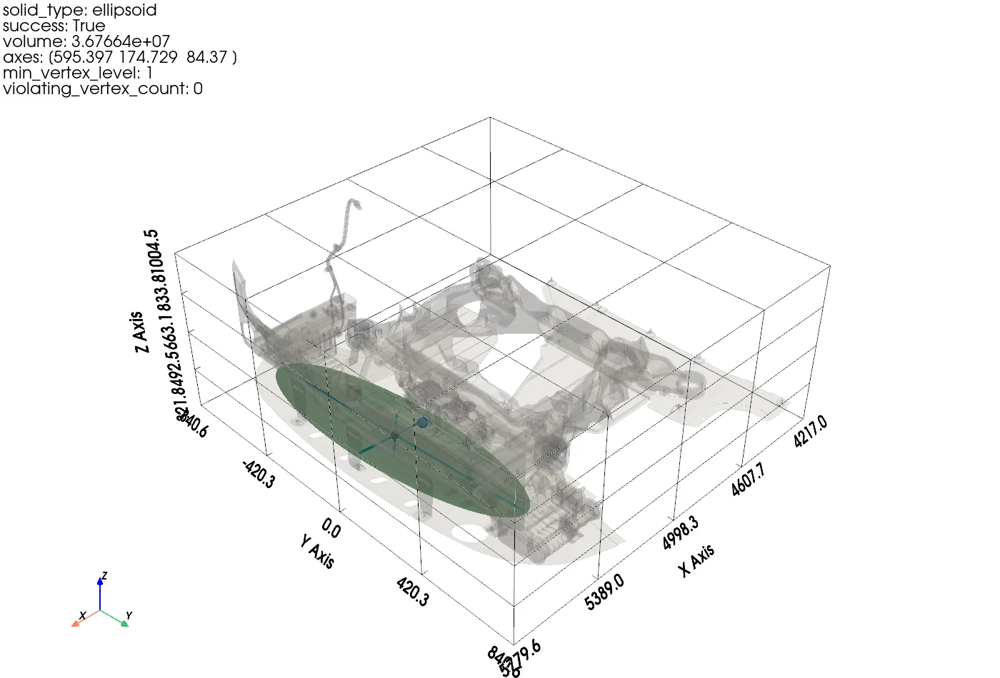
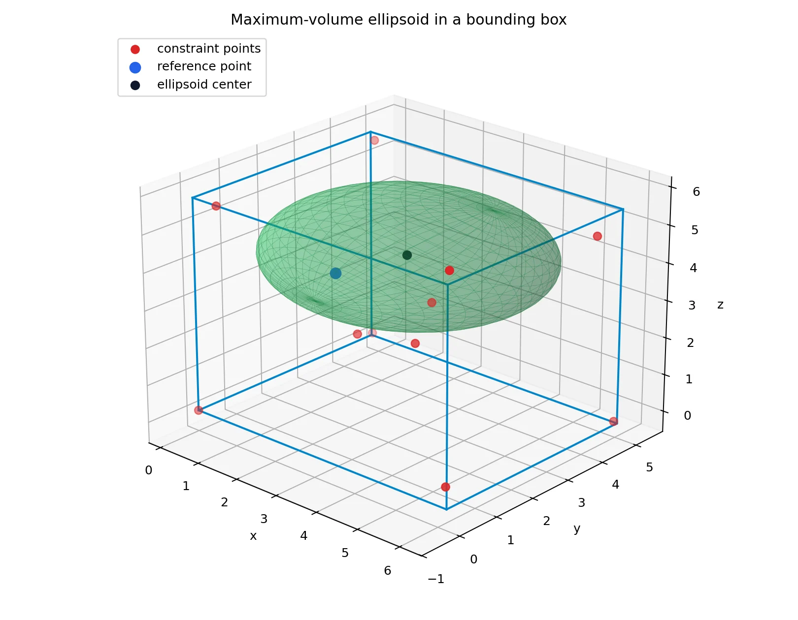

## 项目概述

MaxV 是一个面向 STL 三维几何的参数化实体优化工具。给定复杂表面网格、一个必须被实体包含的参考点和有限搜索边界，程序自动寻找体积尽可能大的椭球或椭圆柱，同时确保搜索区域内的 STL 顶点全部位于实体之外。

这个问题来自工程几何中的空间利用需求：在零件、腔体或复杂障碍表面之间，希望找到一个尺寸尽可能大的规则区域，供后续布置、简化建模或参数化设计使用。MaxV 将网格处理、非凸优化、可行性验证和三维结果展示整合为一条可重复执行的工作流。



## 问题定义

对任意空间点 `x`，程序先用旋转矩阵 `R` 将它变换到候选实体的局部坐标系：`q = Rᵀ(x - c)`，其中 `c` 是实体中心。当前支持两种参数化实体：

| 实体 | 内部判定 | 体积 |
| --- | --- | --- |
| 椭球 | `(q₀/a)² + (q₁/b)² + (q₂/d)² ≤ 1` | `4πabd/3` |
| 椭圆柱 | `(q₀/a)² + (q₁/b)² ≤ 1` 且 `|q₂| ≤ d` | `2πabd` |

优化目标是在最大化体积的同时满足三类约束：

- **参考点约束**：指定参考点必须位于候选实体内部或边界上。
- **网格排除约束**：所有参与优化的 STL 顶点必须位于实体外部，并保留数值安全裕量 `eps`。
- **边界盒约束**：旋转后的整个实体都不能越过用户指定的三维搜索范围。

由于实体中心、尺度和姿态需要同时优化，而每个 STL 顶点都会产生一个排除约束，这是一类大规模、非凸的几何优化问题。

## 求解流程

### 1. STL 裁剪与网格预处理

程序先用搜索边界盒裁剪原始 STL。完全位于范围外的三角面被删除，穿过边界的三角面则在边界处精确裁剪并重新三角化。随后完成顶点去重、可选的自适应网格细分和法向计算。

当启用网格细化时，程序递归拆分过长的三角形边，使每条边都不超过指定阈值。若需要给障碍表面预留工程裕量，还可以将顶点沿面积加权、朝向参考点的法向偏移，再把偏移后的点集送入优化器。

### 2. 参数化搜索与尺度投影

候选实体由中心、三个尺度参数和旋转矩阵共同描述。搜索过程中随机采样中心、轴比例与姿态；在固定这些形状参数后，程序直接计算同时满足边界盒、参考点和当前障碍点约束的最大统一缩放尺度。这样把一部分连续优化转化为显式投影，减少了无效候选。

全局搜索得到较好解后，算法围绕当前最佳候选持续扰动位置、轴比和姿态；若多轮没有改善，则逐步缩小扰动幅度，在探索范围与局部收敛之间取得平衡。椭圆柱还支持固定轴向，仅优化截面方向及其余参数。

### 3. 活跃集迭代

实际模型可能包含数十万个顶点。如果每次评估都检查全部约束，随机搜索的成本会迅速增大。MaxV 先选择距离参考点最近的一小部分顶点作为活跃集，只在这个子集上搜索；随后用完整点集验证候选解，并把最严重的违反点加入活跃集，再进行下一轮优化。

这一过程不断重复，直到全量验证中没有违反点，或达到迭代上限。活跃集机制把“高频、小规模搜索”和“低频、全量验证”分离，在保留最终可行性检查的同时降低了每次候选评估的开销。

### 4. 全量验证与结果输出

程序最终分块扫描全部优化顶点，记录最小 level 值、违反约束的顶点数和活跃集迭代次数。结果以 JSON 保存，包含实体类型、中心、轴长、旋转矩阵、体积、边界盒、预处理参数和运行时间，可直接用于复现实验或接入后续流程。

PyVista 可视化会同时显示原始 STL、半透明优化实体、三个局部主轴、参考点和实体中心，便于直观检查结果与几何边界的关系。



## 当前结果

仓库中保存的两组工程算例都通过了对应预处理条件下的全量顶点验证：

| 实体 | 体积 | 三个尺度参数 | 验证顶点数 | 违反点 | 活跃集迭代 |
| --- | ---: | --- | ---: | ---: | ---: |
| 椭球 | 36,766,397.329 | 595.397 / 174.729 / 84.370 | 283,413 | 0 | 8 |
| 椭圆柱 | 43,968,190.916 | 76.959 / 158.333 / 574.283 | 301,900 | 0 | 6 |

椭圆柱算例从读取网格、边界裁剪和网格细化到优化完成共耗时约 15.21 秒，其中优化阶段约 13.07 秒。该结果固定圆柱轴向为全局 `y` 方向，并在轴向周围继续优化椭圆截面的朝向。

需要注意，两组结果采用了不同的网格细化与法向偏移参数：椭球结果的偏移距离为 10，椭圆柱结果启用了最大边长 100 的网格细化并使用偏移距离 2。因此这些数据用于展示两类实体均可稳定求得可行解，不应被解释为完全相同条件下的严格体积对比。

## 工程特点

- **支持真实 STL 数据**：可读取二进制和 ASCII STL，并处理边界相交三角面、重复顶点及大规模点集。
- **预处理参数可控**：网格细化、法向偏移、顶点焊接和数值容差均可通过命令行配置。
- **结果可验证**：优化结束后扫描完整点集，不以活跃集上的近似可行代替最终验证。
- **几何体可扩展**：椭球与椭圆柱共享统一的中心、尺度、旋转和 level 接口，便于继续增加新的参数化实体。
- **输出便于集成**：结构化 JSON 同时保存几何参数、验证指标、预处理元数据与计时信息。

## 使用方式

安装 `NumPy`、`SciPy` 与 `PyVista` 后，可直接从命令行选择目标实体并生成结果：

```bash
python src/stl_max_volume_ellipsoid.py --solid ellipsoid
python src/stl_max_volume_ellipsoid.py \
  --solid elliptic-cylinder \
  --cylinder-axis 0 1 0 \
  --mesh-refinement 100
```

优化结果可以和原始 STL 一起载入可视化脚本，输出交互式三维视图或静态截图。项目也包含针对边界裁剪、网格细化、面积保持、法向插值和可视化辅助函数的自动化测试。

## 项目收获

MaxV 将复杂工程表面上的空间搜索问题拆解为网格预处理、参数化建模、随机优化、活跃集更新和全量验证五个环节。项目实践了如何在无法直接使用标准凸优化方法的情况下，用几何投影与分层约束检查构建一个可运行、可解释且可验证的求解器，也为后续研究更丰富的内接实体、碰撞约束和确定性优化算法打下了基础。
