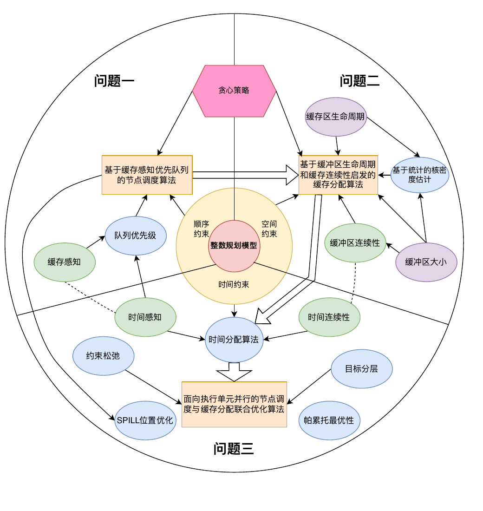
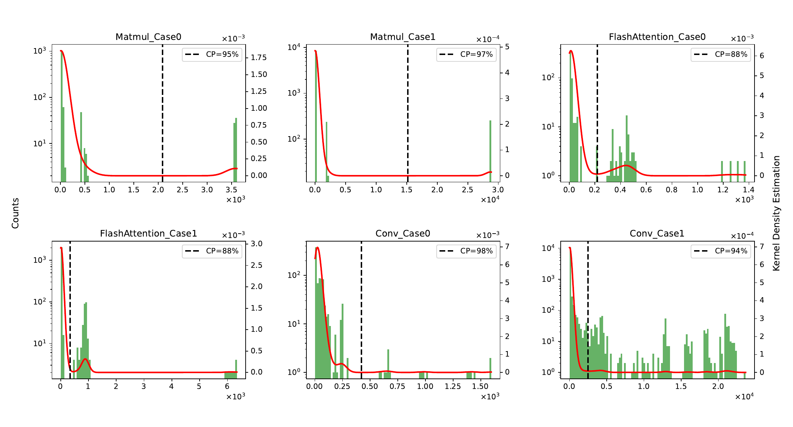
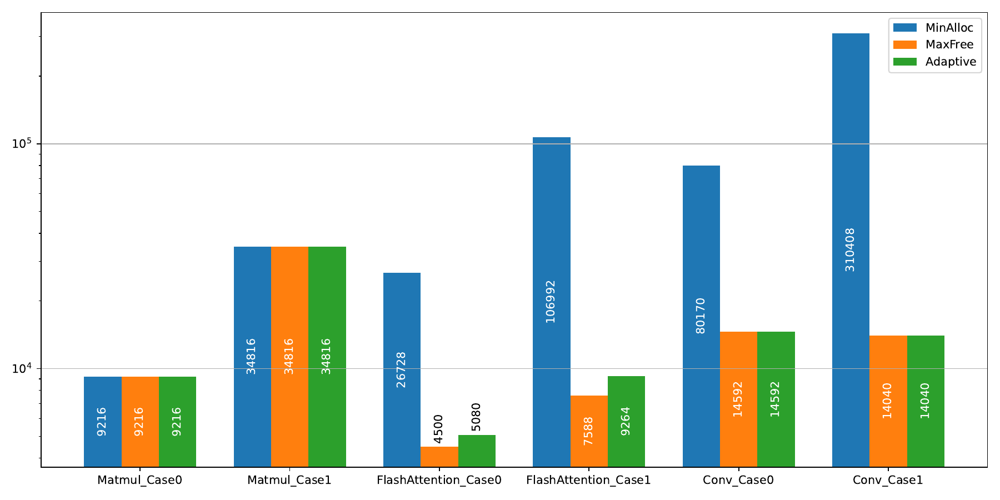
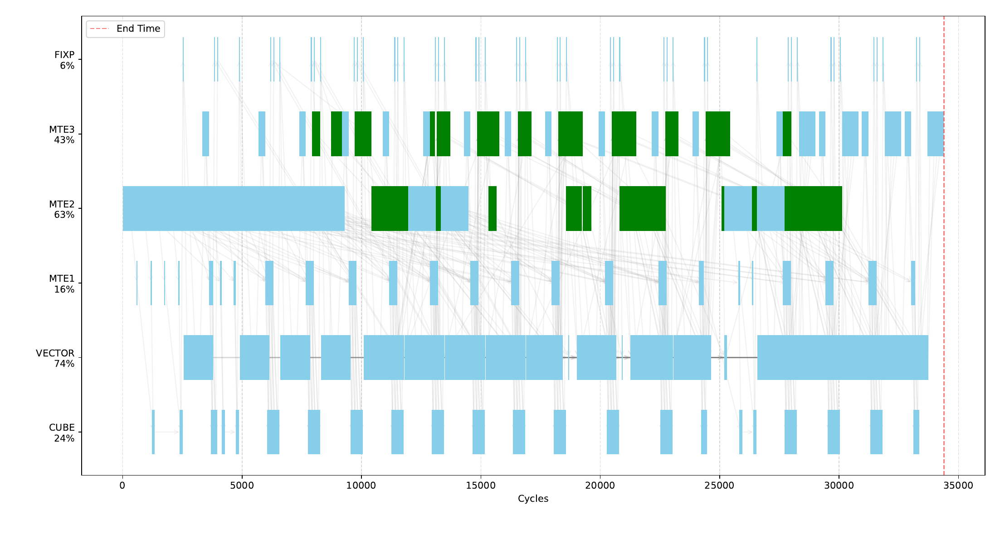

## 项目概述

这是我们参加“华为杯”第二十二届中国研究生数学建模竞赛的作品，研究通用神经网络处理器（NPU）的核内调度问题。项目面向 SIMD 架构下高度异构、拓扑复杂的计算图，希望用自动化调度替代低效的人工编排，在有限缓存条件下兼顾执行时间与数据搬运效率，最终获得竞赛一等奖。

## 问题背景

一个 NPU 核心中同时存在 Cube、Vector 等计算单元，以及 MTE、FIXP 等数据搬运单元。神经网络算子会被拆成一张有向无环图（DAG）：图中的操作节点表示一次计算或搬运，依赖边规定哪些节点必须先完成；与节点关联的数据则存放在 L1、UB、L0A、L0B、L0C 等容量有限的片上缓存中。

可以把它理解为一个“多车间生产 + 有限仓库”的问题：不同操作必须送到指定执行单元，前一道工序完成后后一道才能开始；中间数据需要暂存在仓库里，而且每块数据必须占用一段连续地址。如果缓存装不下，就要把部分数据临时搬到片外 DDR，之后再搬回来，这就是 SPILL。SPILL 会增加访存量和能耗，而过于保守的调度又会让执行单元等待、延长总运行时间。

因此，问题不仅是找一个合法的拓扑序，还要同时回答“先执行谁”“数据放在哪里”“缓存不足时搬走谁”以及“各执行单元何时开始工作”。我们将其分为三个逐步递进的层次：

| 层次 | 需要决定的内容 | 主要目标 |
| --- | --- | --- |
| 问题一：节点调度 | 满足依赖关系的节点执行顺序 | 降低执行过程中的峰值缓存驻留量 |
| 问题二：缓存管理 | 缓冲区地址、地址复用和 SPILL 对象 | 在真实缓存容量内减少额外数据搬运 |
| 问题三：联合优化 | 调度顺序、缓存方案和节点起始时间 | 在搬运量可控的前提下缩短总执行时间 |

## 方法

### 1. 用整数规划统一描述约束

我们首先建立统一的整数规划模型，把节点的调度位置、缓冲区的物理地址、是否发生 SPILL、节点起始时间等作为决策变量。模型同时表达四类核心约束：

- **拓扑约束**：任意节点只能在所有前驱完成后执行。
- **顺序约束**：每个节点在调度序列中只出现一次，所有节点构成一个完整拓扑序。
- **空间约束**：生命周期重叠的缓冲区不能占用重叠的物理地址，且地址不能超出对应缓存容量。
- **时间约束**：同一执行单元同一时刻只能运行一个节点，并且节点的开始时间受到依赖关系和执行单元占用情况共同限制。

这个模型给出了严格的问题定义，但数万节点会带来大量变量与约束，直接用精确整数规划求解很难在竞赛规模上收敛。因此，模型主要用于厘清可行域和目标，实际求解采用与模型约束一致的启发式算法。

### 2. 缓存感知的优先队列调度

算法维护当前所有“前驱已经完成”的就绪节点，并用优先队列动态选择下一个节点。每调度一个节点，就更新其后继的入度、当前缓存占用和可释放空间，再把新就绪节点加入队列。我们比较了三种优先规则：

- **最小缓存增加（MinAlloc）**：优先执行新增缓存需求较小的节点。
- **最大缓存释放（MaxFree）**：优先执行能够尽快释放更多缓存的节点。
- **自适应策略（Adaptive）**：根据当前缓存占用率，在申请和释放导向的规则之间切换。

与每一步扫描全部候选节点相比，堆式优先队列把节点插入和弹出的代价降到 `O(log N)`。设计算图有 `N` 个节点、`M` 条边，完整算法最坏时间复杂度为 `O(N log N + M)`。

### 3. 基于生命周期的缓存分配与 SPILL

确定调度顺序后，每个缓冲区从 ALLOC 到 FREE 的区间就是它的生命周期。算法沿调度序列维护各级缓存的空闲区间，优先把新缓冲区放进能够保持剩余空间连续的位置，减少“总空闲空间足够、但没有一段连续地址可用”的缓存碎片。

缓冲区的生命周期分布高度偏斜：多数数据只短暂存在，少数数据需要长期驻留。我们使用核密度估计曲线的第一个局部极小值作为自适应阈值，将缓冲区分成长驻留和短驻留两类；地址分配时将长驻留区域集中在缓存尾部，为短时间的大缓冲区保留更连续的前部空间。

当连续空间仍不足时，算法综合缓冲区大小、剩余生命周期和未来使用位置选择 SPILL 对象，插入 SPILL_OUT 与 SPILL_IN 节点。Matmul、Conv 与 FlashAttention 的数据复用特征不同，因此换出优先级也随计算图特征调整，而不是使用固定阈值或单一规则。

### 4. 执行时间与搬运量的联合优化

在完整调度方案上，我们根据拓扑依赖和执行单元独占约束计算每个节点的最早开始时间，并识别关键路径、执行单元空闲区间和时间碎片。联合优化采用分层思路：先得到满足真实缓存容量的基准解，再逐步放宽中间约束，搜索并行度更高的候选调度；只有当额外数据搬运量仍处于给定容忍范围内时才保留候选解，最后筛选帕累托非支配解。

## 结果

算法在 Matmul、FlashAttention 和 Conv 的六个典型计算图上进行了验证。三种调度策略在简单 Matmul 算例上结果接近；随着计算图复杂度增加，“最大缓存释放优先”明显优于“最小缓存增加”。在 Conv_Case1 上，峰值缓存占用由 310408 降至 14040，降幅约 95%。

在加入缓存分配与 SPILL 后，六个算例均满足各级缓存容量约束。部分算例的 L1 与 UB 峰值达到或接近容量上限，说明算法能够利用有限缓存和碎片空间，而不是通过保留大量空闲区来换取可行性。

下图展示了 FlashAttention_Case0 的执行单元占用情况。浅蓝色块表示普通节点，绿色块表示 SPILL 操作；MTE2、MTE3 承担大量缓存与 DDR 之间的数据搬运，Vector 单元也保持较高占用率。泳道图将“节点依赖、执行单元并行和 SPILL 开销”同时呈现出来，便于检查调度方案在硬件上的实际执行形态。

联合优化只在个别算例上缩短了总执行时间，在大部分算例中没有形成显著改进。这说明缓存驻留、SPILL 与执行单元并行之间的耦合比单目标问题更复杂，当前的约束松弛和时间感知策略仍有改进空间。

## 项目应用价值

- **支撑 AI 编译器自动调度**：将人工编排计算单元流水的问题转化为可自动执行的图调度与缓存分配流程，可作为算子编译、指令调度和代码生成阶段的算法原型。
- **提高片上缓存利用率**：连续地址分配、生命周期分析和 SPILL 决策有助于减少缓存碎片与不必要的 DDR 访问，潜在收益包括降低访存延迟和数据搬运能耗。
- **辅助硬件与算子协同设计**：算法可以输出缓存峰值、SPILL 数量、执行单元利用率和总周期数，为比较缓存容量、流水线配置与算子拆分方案提供量化依据。
- **迁移到其他异构 DAG 调度问题**：优先队列调度、生命周期分配和帕累托权衡并不依赖单一算子，可作为 GPU/NPU 编译、异构任务调度和受限存储资源分配问题的参考框架。

这些价值目前主要来自模型分析与六个竞赛算例验证；要进入真实编译器或硬件工具链，还需要加入更多工业计算图、基准算法对比和设备实测。

## 项目收获

这项工作把复杂的工程调度问题转化为可分析的数学模型，并在精确建模与工程可计算性之间做出取舍。项目覆盖了整数规划、图算法、缓存管理、启发式搜索和多目标优化，也形成了从模型推导、算法实现到实验验证的完整工作流程。
