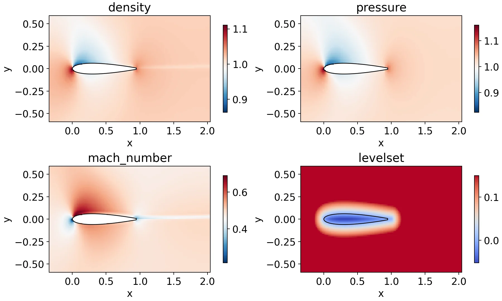
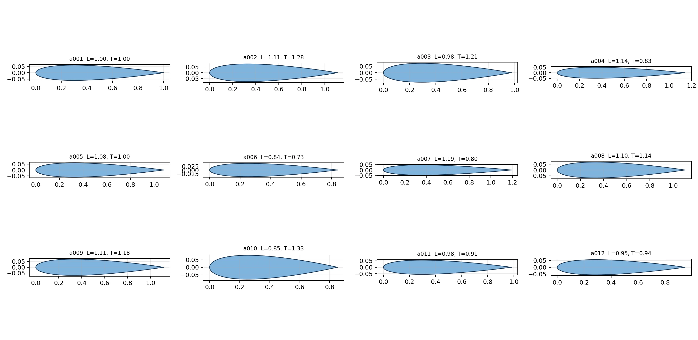
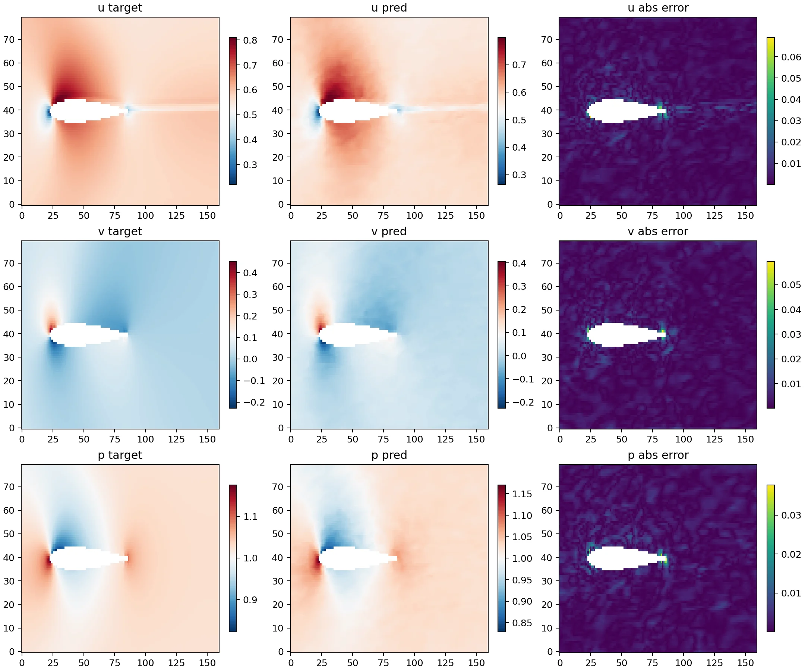
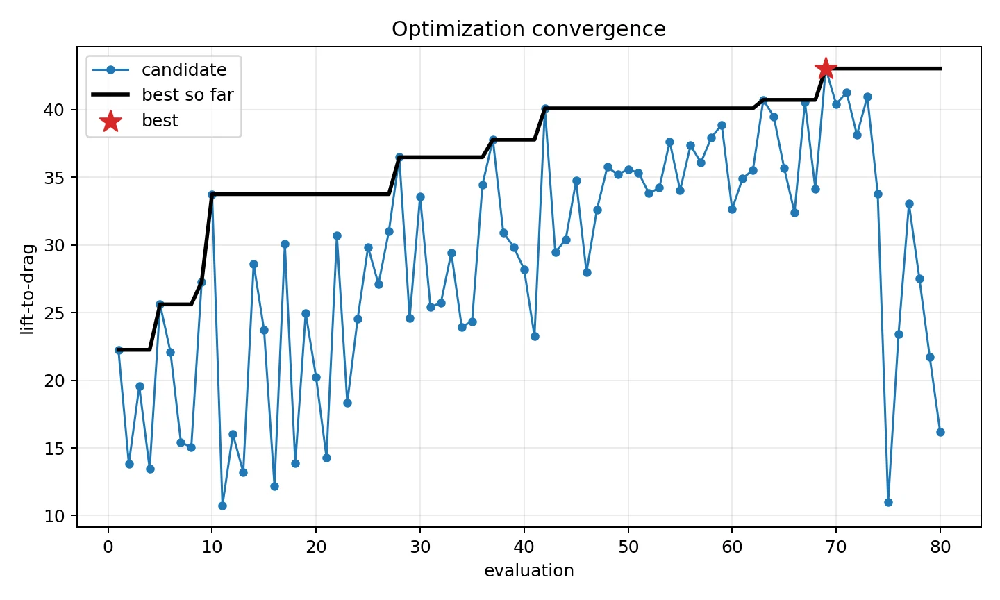
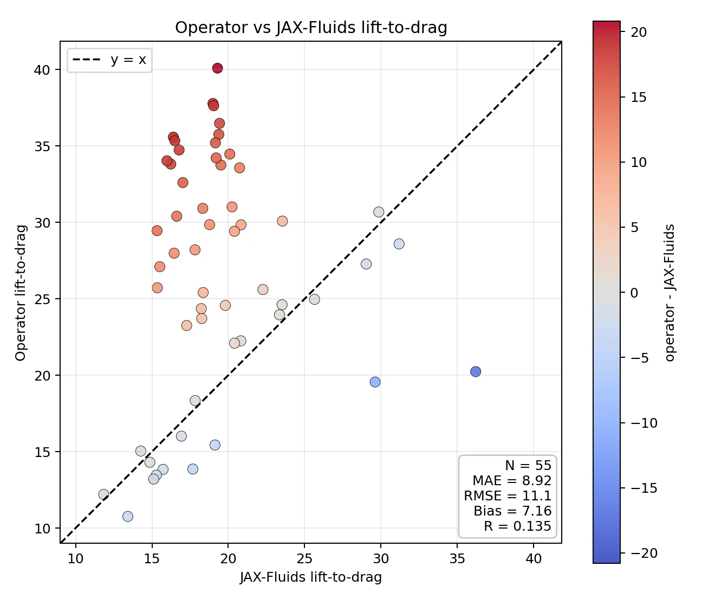

如果一个神经网络预测出的流场与 CFD 结果几乎难以区分，我们是否就可以放心地让它替代求解器，去寻找更好的翼型？

这个项目最初只是想建立一条更快的设计路径。传统 CFD 能够给出可信的密度、速度和压力分布，但在设计空间里反复调用它，计算成本会迅速累积。神经算子提供了另一种可能：先从一组高保真样本中学习几何与流场之间的映射，再用近乎即时的预测代替重复求解。

真正有意思的部分却出现在项目后半程。当预测模型开始替我们做设计决策时，“流场预测得准”与“优化方向值得相信”不再是同一个问题。

## 把翼型设计变成一个可控实验

为了让问题足够清楚，我没有一开始就追求复杂的自由曲面，而是从一个标准翼型出发，只改变它的长度和厚度。两个参数虽然简单，却已经能够形成一组具有明显差异的几何：有的更修长，有的更厚，有的则接近原始形状。

这样的设计空间更像一个受控实验室。几何变化是已知的，来流条件保持一致，观察到的流场差异可以较明确地归因于翼型本身。最终生成了 24 个参数化翼型，并为每个翼型获得一段完整的 CFD 演化过程。

24 个样本并不是一个足以覆盖复杂空气动力学规律的大数据集。它的意义在于验证一条完整链路：几何可以系统地产生，流场可以批量计算，数据能够在不同翼型之间保持一致的物理含义，学习模型也能在没有见过的几何上接受检查。

## 一个看起来非常好的预测模型

神经算子学习的不是某个位置上的单一数值，而是从翼型几何和来流状态到整个速度、压力场的映射。保留一部分翼型不参与训练后，模型在这些未见样本上的流体区域平均相对 L2 误差约为 0.49%。

从可视化上看，主要流动结构也得到了较好恢复：前缘附近的速度变化、翼型上下表面的压力差以及尾缘后的流动特征，都能在预测场中辨认出来。误差主要集中在几何边界和梯度较强的区域，这也是流场学习中最敏感的位置。

如果目标只是快速重建流场，到这里已经可以得到一个相当乐观的结论。代理模型能够用很低的成本给出与 CFD 接近的整体分布，为参数扫描、初步筛选和交互式探索提供帮助。

## 当模型开始参与设计决策

接下来，我让代理模型走出“复现已知流场”的安全区域，开始在长度和厚度构成的设计空间中寻找更高的升阻比。由于一次预测远快于一次完整 CFD 计算，可以连续考察许多候选，而不必为每个方案重新进行时间推进。

在 80 次候选评估中，模型给出的最优升阻比从基准翼型的约 22.25 提高到 43.03。搜索过程看起来也很合理：随着新的候选被尝试，当前最优值逐步上升，最后落在较薄翼型附近。

这是一个很容易让人提前庆祝的时刻。曲线在上升，预测流场看起来合理，目标值几乎翻倍。如果只展示这张图，项目会自然地变成一个“神经算子成功加速翼型优化”的故事。

但代理模型的最优，只意味着它在自己学到的世界里找到了最优。工程设计真正关心的是，这个排序回到高保真物理模型后是否仍然成立。

## 一次必要的回验

为了检查这件事，我把搜索过程中产生的候选重新送回 JAX-Fluids。已完成回验的 55 个翼型显示出一个比优化曲线复杂得多的画面：代理模型预测的升阻比与重新计算的升阻比并没有沿对角线聚集。

两者的平均绝对差约为 8.92，相关系数只有 0.135，而且代理模型整体存在约 7.16 的正偏差。换句话说，它通常把候选评价得过于乐观，也没有可靠地保持不同设计之间的优劣顺序。代理模型给出的最终最优候选尚未包含在这批已完成回验的方案中，因此 43.03 不能被视为经过验证的设计收益。

这并不意味着前面的流场模型完全失败了。相反，它回答了另一个问题：整体速度和压力分布能否被近似重建。真正出现落差的是，从高维流场到单一工程指标的最后一步。

升阻比对误差尤其敏感。它不是对全域误差的平均，而是由翼型表面附近的压力积分得到升力和阻力，再取二者的比值。阻力通常比升力小得多，即使压力场只有局部而细微的偏差，也可能对阻力产生显著的相对影响；当这个误差进入分母后，最终的升阻比会进一步被放大。

因此，一张视觉上很接近的流场图、一个很小的全域相对误差，都不能自动保证积分量正确，更不能保证模型在优化过程中给出的排序正确。

## 从“更快”走向“可信”

这次实验改变了我对 AI for CAE 中“代理模型精度”的理解。一个面向工程设计的模型至少需要经历三个层次的检验：它是否能重建主要物理场，是否能准确计算真正关心的工程量，以及是否能在设计空间中保持候选方案的相对排序。前两个问题回答的是预测，最后一个问题才决定它能否参与优化。

更可靠的路径并不是让代理模型完全取代高保真求解器，而是让两者形成闭环。代理模型负责快速探索和缩小范围，高保真计算负责校正关键候选；当搜索逐渐走向训练数据稀疏或目标量敏感的区域时，再把新的高保真结果反馈给代理模型。这样，计算加速不再建立在一次性的误差指标上，而是建立在持续验证和修正之上。

从这个角度看，项目最重要的收获并不是找到一个看似更高升阻比的翼型，而是识别出了流场代理走向工程决策时的可信边界。对 AI for CAE 而言，速度很重要，但知道模型什么时候不该被相信，往往更重要。
