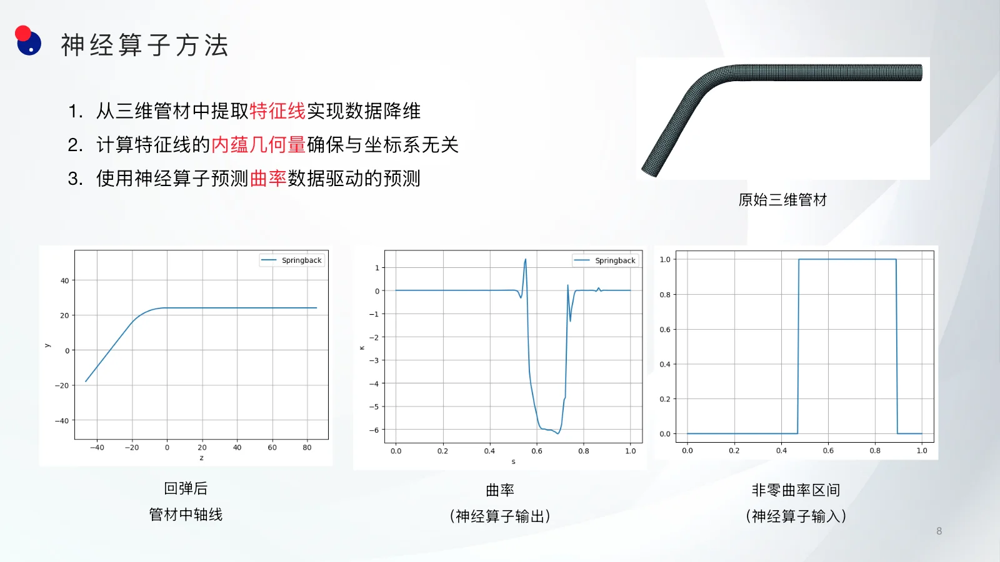
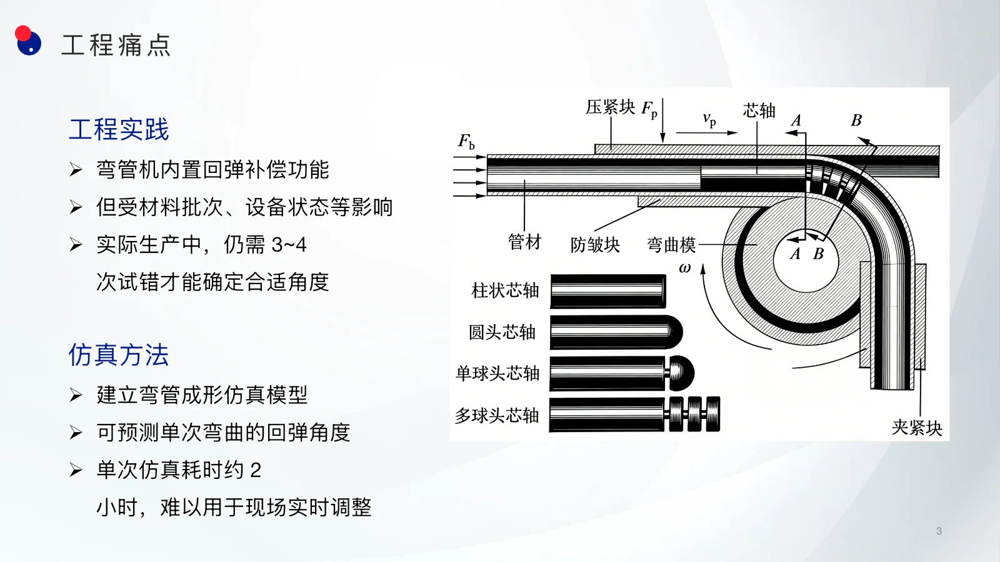
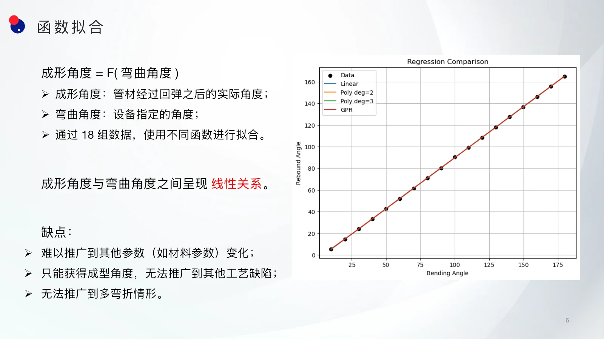
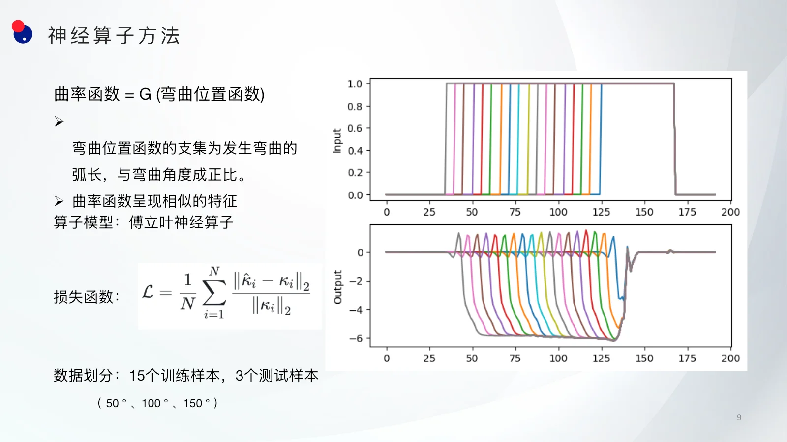
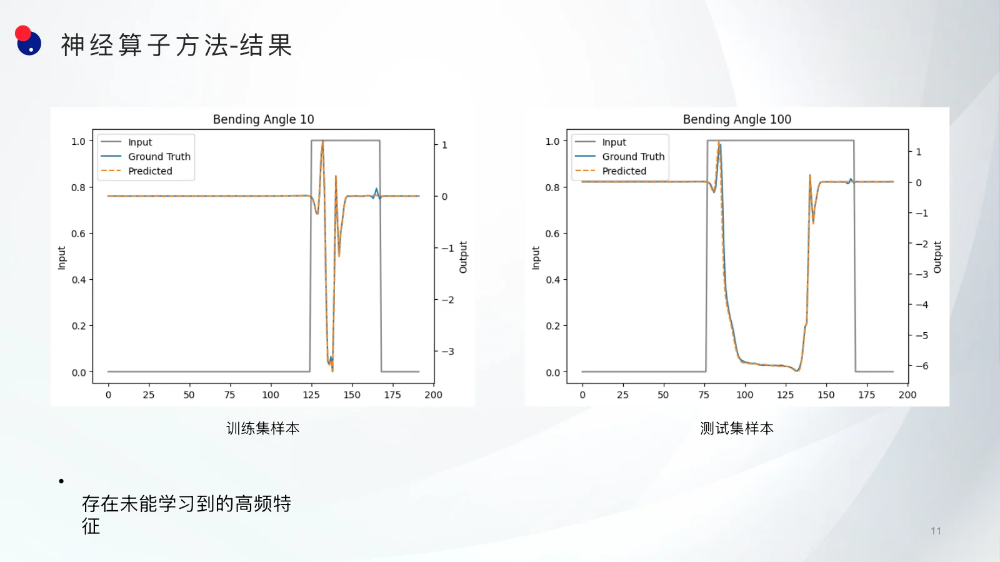
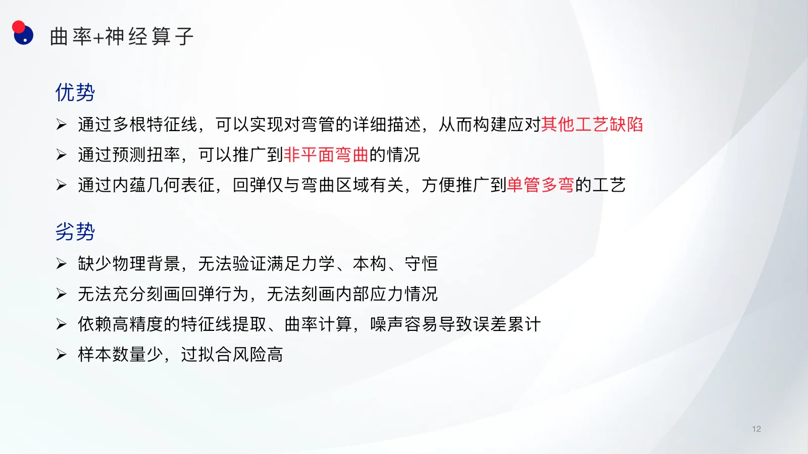

管材绕弯广泛应用于汽车、航空与能源装备。成形结束、载荷卸除后，弹性恢复会使实际成形角度偏离设备设定角度，这种回弹不仅影响尺寸精度，也会给后续装配带来困难。

工程现场通常依赖弯管机的回弹补偿功能，但材料批次和设备状态的变化仍可能带来 3～4 次试错。高保真有限元仿真可以预测单次弯曲后的回弹角度，却需要约 2 小时完成一次计算，难以直接支持现场快速调整。

本项目探索了一条更轻量的路径：从三维管材中提取能够描述形状的特征线，用曲率表达回弹后的几何状态，再训练神经算子学习“弯曲区域”到“回弹后曲率”的函数映射。目标不是一次性替代有限元，而是验证小样本条件下快速预测管材成形几何的可行性。

## 工程问题：仿真可信，但反馈太慢

绕弯过程同时包含弹塑性、接触与大变形，回弹还会受到弯曲角度、弯曲半径、材料属性、管径壁厚、设备精度和摩擦系数等多类因素影响。完整问题的最终目标，是在给定工艺与材料条件后快速重建成形结果，并进一步识别截面畸变等潜在缺陷。

本阶段先收缩问题范围，只考察弯曲角度对回弹的影响。这样既能形成清晰的数据闭环，也能检验几何表征与神经算子是否适合这类成形问题。

## 数据准备：18 组单次弯曲仿真

数据由 Abaqus 生成。模型采用三维圆柱形、无厚度管材，并将弯曲限制在 `yoz` 平面内；设备设定角度从 10° 到 180°，以 10° 为步长采样，共得到 18 个仿真样本。每个样本完成后，再通过后处理计算管材回弹后的实际成形角度与中轴线几何。

如果只把问题写成“设备弯曲角度 → 实际成形角度”的标量回归，18 组数据表现出明显的线性关系。这个基线足以回答单一角度补偿问题，却难以纳入材料或设备参数，也无法描述截面畸变、多次弯折和空间曲线等更复杂的工艺结果。

## 关键表征：从三维坐标转向内蕴几何

为了让模型摆脱管材在空间中的绝对位置、朝向和总长度，方法不直接学习三维网格节点坐标，而是先提取管材中轴线，并沿归一化弧长计算曲率。曲率属于曲线的内蕴几何量，能够表达局部弯曲程度，同时保持对刚体平移和旋转的不敏感性。

输入被构造成一条弯曲位置函数：发生弯曲的弧长区间取值为 1，其余位置取值为 0；在当前数据中，这一支集长度与设备弯曲角度成正比。输出则是管材卸载回弹后的曲率函数。学习任务因此从有限维参数拟合，转化为函数到函数的算子学习：

`弯曲位置函数 χ(s) → 回弹后曲率函数 κ(s)`

这一表示保留了沿管材的空间分布，使模型不仅能给出一个最终角度，还能描述弯曲区及其边界附近的局部几何响应。

## 傅立叶神经算子：学习一族曲率函数

项目采用傅立叶神经算子（FNO）拟合上述映射，并使用曲率函数的平均相对 L2 误差作为损失。18 个样本中，15 个用于训练，50°、100° 和 150° 三个样本留作测试。

与逐点回归相比，神经算子直接学习整条输入函数与整条输出函数之间的关系；频域卷积能够在统一离散网格上建模不同弯曲区间对应的曲率形态，为后续纳入更多工艺参数保留了空间。

## 原型结果：总体趋势可学，高频细节仍是难点

训练过程中，训练集与测试集损失都逐步下降；在展示的最终轮次，训练损失约为 `1.21×10⁻²`，测试损失约为 `4.16×10⁻²`。在 100° 测试样本上，预测曲率能够复现弯曲区内的主要幅值与整体形态，说明模型已经捕捉到输入区间与回弹几何之间的基本对应关系。

误差主要出现在弯曲区边界附近的尖峰和振荡。这里包含更强的高频成分，也最容易受到特征线提取、曲率数值微分与有限样本覆盖不足的共同影响。因此，当前结果更适合作为方法原型，而不能被理解为已经通过工程验证的实时替代模型。

## 方法价值与适用边界

这一路径的价值在于把复杂三维成形结果压缩为与坐标系无关的一维几何函数，使小规模数据也能进入算子学习流程。若进一步提取多根特征线，可用于描述截面畸变等局部缺陷；若将输出扩展到曲率与扭率，还可面向非平面弯曲；内蕴几何表征也为单根管材的多次弯曲提供了更自然的统一描述。

与此同时，纯数据驱动模型并不自动满足力学平衡、本构关系和守恒条件，也无法直接恢复内部应力。曲率由特征线数值微分得到，对几何噪声十分敏感；当前样本数量较少，测试误差与高频偏差也提示了过拟合风险。

## 下一步

后续工作需要逐步加入材料参数、弯曲半径、摩擦与壁厚等影响因素，并用更多高保真样本覆盖多参数工况；同时，可在损失函数中加入几何平滑与物理约束，提升弯曲区边界的高频预测能力。最终仍需把神经算子的快速筛选与有限元回验结合起来，形成可校正、可追溯的工程闭环。

本报告由叶再俊（上海师范大学）汇报，与邹海峰（深圳大数据研究院）合作完成，并在“人工智能赋能计算科学青年研讨会”中交流。
